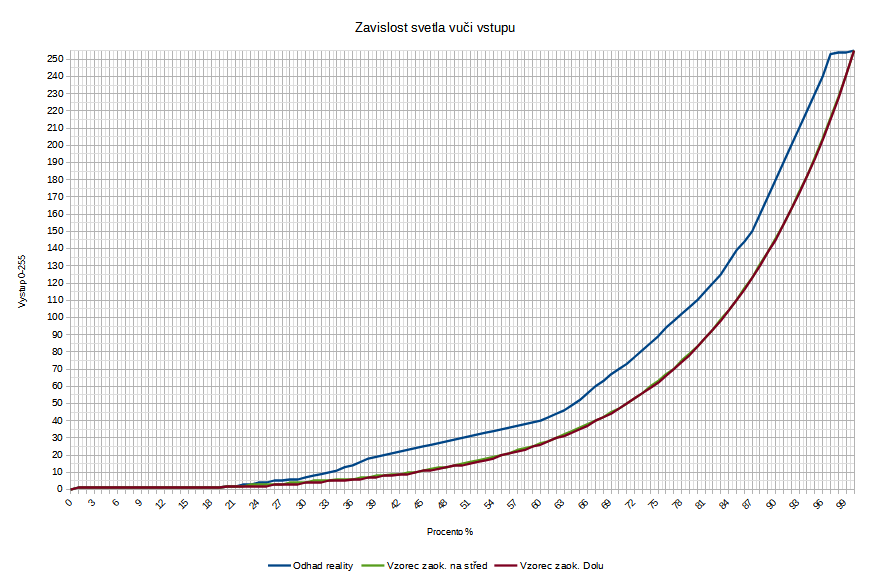
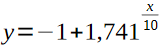
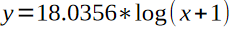
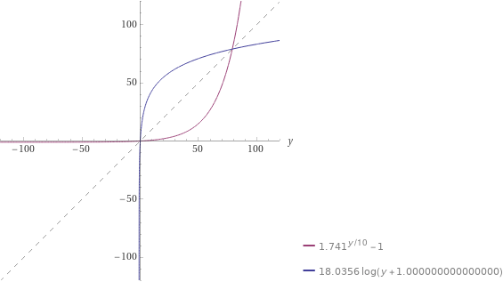

#Nastaveni podsvícení
PWM piny Arduina jsou schpny generovat pwm pulz v rozsahu od 0[0%] do 255[100%] intenzity svícení.
Ovšem realná intenzita svícení není lineárně úměrná vůči pwm pulzům.

x = vstup v rozsahu od 0 do 100 v jednotce %
y = pwm výstup v rozsahu od 0 do 255
| rozsah x | vzorec | rozsah y| popis|
|---|---|---|---|
|0|y = 0|0|vypnuté světlo|
|1,19|y = 1|1|minimální světlo|
|20,99||2,241|regulace svícení|
|100|y = 255|255|maximalni svicení|
Převod zpět z pwm do procent, pomoci inverzní funkce:
x = pwm výstup
y = procenta
| rozsah x | vzorec | rozsah y| popis|
|---|---|---|---|
|0|y = 0|0|vypnuté světlo|
|1|y = 10|10|minimální svícení odhadnuté na 10%|
|2,254||20,99|regulace svicení|
|255|y = 100|100|maximálni svicení|

Porovnání obou funkcí:
