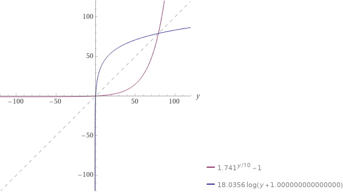

#Nastaveni podsvícení
PWM piny Arduina jsou schpny generovat pwm pulz v rozsahu od 0[0%] do 255[100%] intenzity svícení.
Ovšem realná intenzita svícení není lineárně uměrná vuči pwm pulzům.

x = vstup v rozsahu od 0 do 100 v jednotce %
y = pwm výstup v rozsahu od 0 do 255
| rozsah x | vzorec | rozsah y| popis|
|---|---|---|---|
|0|y = 0|0|vipnute svetlo|
|1,19|y = 1|1|minimální svetlo|
|20,99||2,241|regulece svicení|
|100|y = 255|255|maximalni svicení|
Prevo zpet z pwm do procent pomoci inverzní funkce:
x = pwm výstup
y = procenta
| rozsah x | vzorec | rozsah y| popis|
|---|---|---|---|
|0|y = 0|0|vipnute svetlo|
|1|y = 10|10|minimální svícení odhadnute na 10%|
|2,254||20,99|regulece svicení|
|255|y = 100|100|maximalni svicení|

Porovnani obou grafu:
