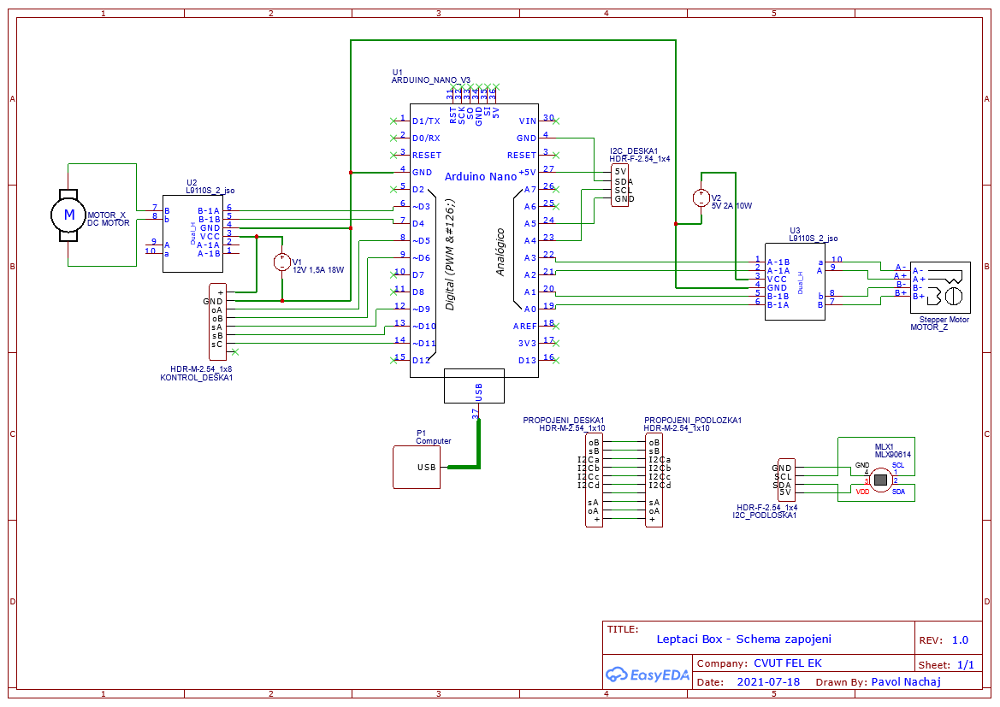
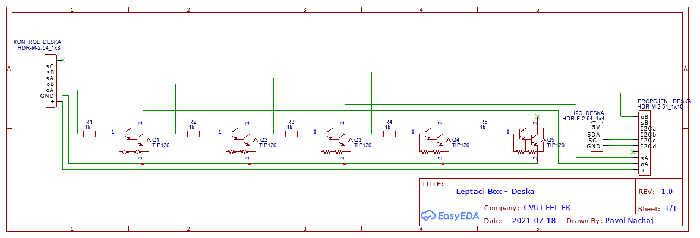
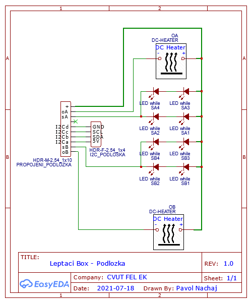

# Schema
V pdf je schématicky znázorněné zapojeni.
* Schema zapojeni - Celkové propojeni

* Deska - Jde o plošný spoj vlastní výroby. Ovládá Desku.

* Podlozka - Jde o konstrukci vlastní výroby, kde je umistěné podsvíceni misek a konektory pro topné tělesa... 

## Popis zapojeni soustavy
###Komponenty:
* Arduino Nano - Řidi celou elektroniku. Má funkci mikrokontrolóru.
* USB kabel, ktery spojuje Arduino s PC
* Zdroj napěti 5V
* Zdroj napěti 12V 2A
* H-můstek pro 12V, který ovládá MotorX
* H-můstek pro 5V, který ovládá MotorZ
* MotorX dc 12V motor, s proudovou špičkou kolem 1,5A
* MotorZ je "CD-ROM Stepper motor"
* Senzor teploty MLX90614. Jde o infračervený snimač. Měří jak teplotu okoli, tak i objektu, na který je namířený.
* Deska vlástni výroby. Spíná kontakty na podložce pro podsviceni a topeni.
* Podložka. Vlastni výroby.

###GND spojeno s:
* GND Arduino a následně:
    * USB kabel a zdroj počítače...
    * GND Senzor teploměru
* Zabudovaný zdroj 12V
* Zabudovaný zdroj 5V
* GND H-můstek pro 12V MotorX
* GND H-můstek pro 5V MotorZ
* GND deska vlastní výroby.

###Napájení:
####12V:
* Vcc H-můstek pro 12V MotorX
* (+) Deska vlastní výroby
####5V:
* Vcc H-můstek pro 5V MotorZ
####USB 5V:
* Arduino 5V
* Vcc teploměr

## Zapojení Arduino Nano
Vyrobil jsem pomoci BSL vlasní konektory. Pojmenoval jsem je "Sloty". 
* Slot1 - 4 pin. od GND do D4
    * GND - země zdrojů
    * D3 pwm - Pwm kontroler motoru X
    * D4 - Kontroler motoru X
* Slot2 - 8 pinu od D5 do D12
    * D5 pwm - Ohřev A
    * D6 pwm - Ohřev B
    * D9 pwm - Světlo A
    * D10 pwm - Světlo B
    * D11 pwn - Světlo C
* Slot3 - 4 pinu do A0 do A3
    * A3 - konektor A- pro motor Z
    * A2 - konektor A+ pro motor Z
    * A1 - konektor B- pro motor Z
    * A0 - konektor A+ pro motor Z
* Slot4 - 8 pinu od A4 od VIN
    * GND - zep pro senzor MLX.
    * 5V - napájeni pro senzor MLX.
    * A5 - SCL pro senzor MLX.
    * A4 - SDA pro senzor MLX.

